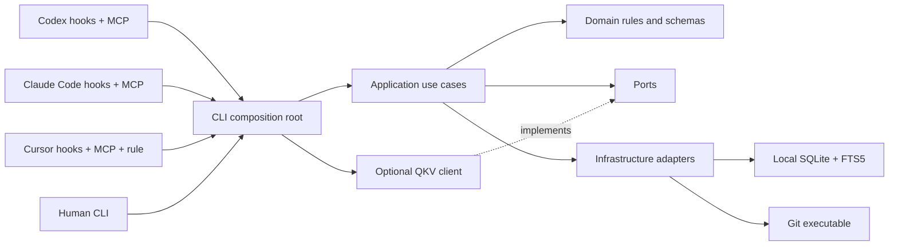
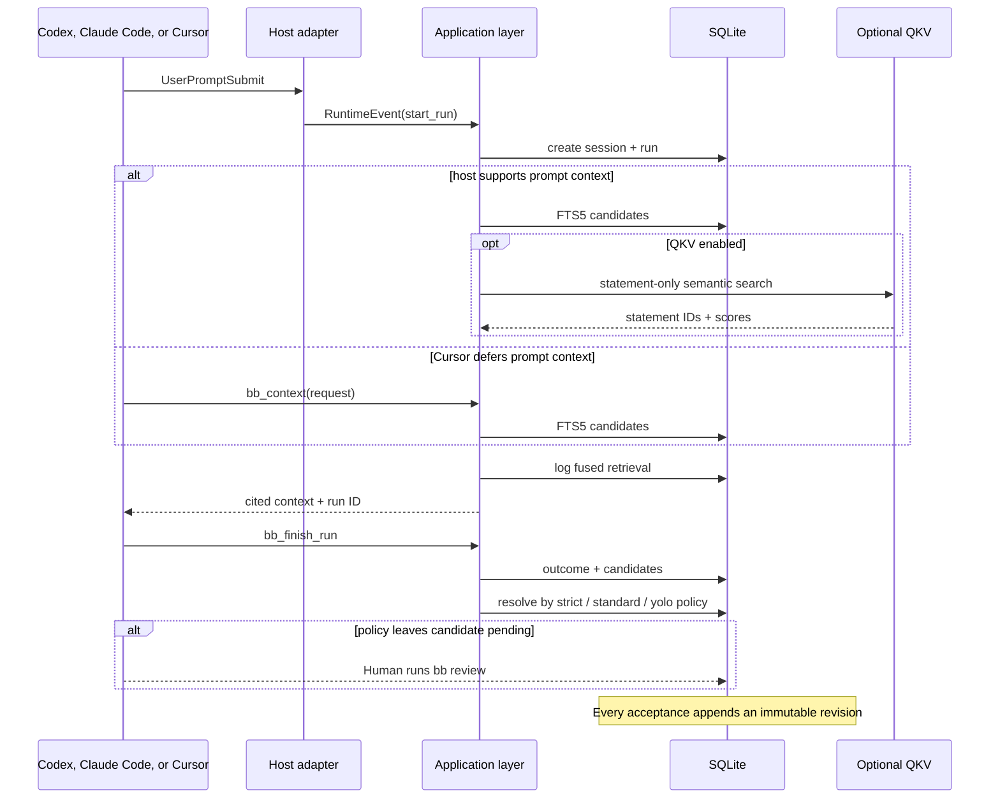

# Architecture

bb-code has one core rule: host integrations depend on the runtime, while the runtime never depends on a host.

The arrows point inward toward policy. Domain code has no knowledge of SQLite, Git, MCP, Codex, Claude Code, Cursor, or QKV.

## Layers

### Domain

Location: `packages/core/src/domain`

Owns stable product language and validation:

- `knowledge.ts` — intents, beliefs, commitments, scopes, candidates, and revisions.
- `runtime.ts` — sessions, normalized lifecycle events, verification, and completion.
- `context.ts` — retrieved context items and results.
- `ids.ts` and `errors.ts` — shared domain primitives.

Domain modules are deterministic. They do not read files, execute Git, open databases, or call a network.

### Application

Location: `packages/core/src/application`

Owns workflows by use case:

- `workspace` initializes and opens a repository.
- `context` retrieves, ranks, and renders applicable statements.
- `runs` records proposals and structured completion.
- `runtime` processes normalized host lifecycle events.

Application modules coordinate domain rules through stable ports and the persistence facade. Ranking and rendering are pure functions so they can be tested without SQLite.

### Ports

Location: `packages/core/src/ports`

Ports describe replaceable capabilities. `SemanticRetrievalProvider` is the first port: local retrieval does not know or care whether semantic candidates come from QKV or a future provider.

Adding a provider means implementing the port in a separate package. It must not introduce provider types into the domain.

### Infrastructure

Location: `packages/core/src/infrastructure`

Owns external details:

- `git/git-client.ts` shells out to Git without using a shell command string.
- `filesystem/data-paths.ts` resolves operating-system data locations.
- `sqlite/connection.ts` owns connection settings and transactions.
- `sqlite/migrations.ts` owns forward-only schema creation.
- focused SQLite stores own repository identity, runs, knowledge, and search.
- `sqlite/bb-database.ts` is a small persistence facade for application code.

SQL does not appear in application or domain modules.

### Composition and delivery

Location: `apps/cli/src`

The executable package connects the layers:

- `commands` contains human-facing command groups.
- `adapters` translates Codex, Claude, and Cursor payloads into `RuntimeEvent`.
- `mcp` exposes exactly four tools.
- `composition` selects optional implementations such as QKV.
- `cli.ts` only assembles commands; `launcher.ts` handles process startup.

Host-native payloads stop at `normalize-hook-event.ts`. The normalized payload intentionally excludes source code, tool bodies, transcripts, and secrets.

### Host capability translation

The application returns host-neutral runtime effects: retrieved context,
applicable path commitments, a completion reminder, a blocking completion
nudge, or a missing-completion observation. Delivery adapters translate those
effects according to documented host capabilities. Core never branches on
Cursor, Codex, or Claude response schemas.

Cursor cannot inject context from `beforeSubmitPrompt`, and its Stop
`followup_message` is submitted as a new user turn. Its adapter therefore
defers retrieval to one `bb_context` call, uses `postToolUse.additional_context`
for one terse reminder after consequential work, and silently finalizes an
unfinished Stop as partial. Because `preToolUse` has no non-blocking context
field, the adapter denies the first attempt that touches a path-scoped
commitment with agent-facing guidance; a persisted guidance event makes the
retry non-blocking. Codex and Claude retain prompt-time context injection and a
single blocking Stop nudge.

## Runtime flow

## Persistence boundaries

SQLite is the source of truth. The `BbDatabase` facade keeps table layout out of workflows while focused stores keep SQL grouped by aggregate:

| Store | Responsibility |
|---|---|
| `RepositoryStore` | repositories, knowledge mode, locations, worktrees, Git views |
| `RunStore` | sessions, runs, events, Stop policy, completion |
| `KnowledgeStore` | statements, revisions, evidence, candidate review |
| `SearchStore` | FTS, retrieval logs, provider state, sync jobs |

Transactions live in `SqliteConnection`. Candidate acceptance and revision changes use the same connection and can nest safely inside one transaction.

## Dependency rules

1. `domain` imports only domain modules and third-party validation primitives.
2. `application` may import domain, ports, and infrastructure facades.
3. `infrastructure` may implement domain persistence but cannot import delivery code.
4. `apps/cli` may compose every public package; core never imports from `apps`.
5. Plugins contain declarations and skills only. Product behavior stays in the runtime.
6. QKV remains optional. Every workflow must work with the semantic port absent or failing.

## Extension paths

- New coding host: add one normalizer and hook/plugin declarations. Do not change core domain types unless the shared protocol truly needs a new concept.
- New semantic provider: implement `SemanticRetrievalProvider` outside core.
- New database version: add a forward-only migration; preserve immutable statement revisions.
- New UI: call application use cases and the review facade. Never update knowledge tables directly.
- OpenCode: add a delivery adapter, not a fork of the runtime or agent.
